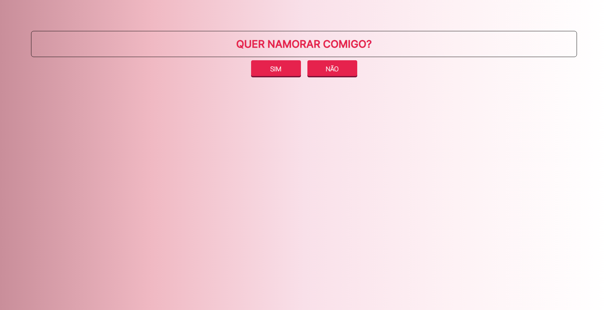

# QuerNamorarComigo

Projeto de pedido de namoro em HTML, CSS e JavaScript

Este projeto é um pedido de namoro simples e criativo, utilizando apenas HTML, CSS e JavaScript. O objetivo é que a pessoa amada não possa dizer não ao pedido, pois o botão "não" irá teletransportar para outro local quando ela se aproximar dele.

Como funciona?

O projeto consiste em uma página web com um botão "sim" e um botão "não". Quando a pessoa amada clica ou se aproxima do botão "não", ele é teletransportado para outro local. O botão "sim" permanece visível, permitindo que ela diga sim ao pedido.

Código

O código do projeto é simples e fácil de entender. O HTML é responsável pela estrutura básica da página, o CSS é responsável pelo estilo e o JavaScript é responsável pela lógica do pedido.
